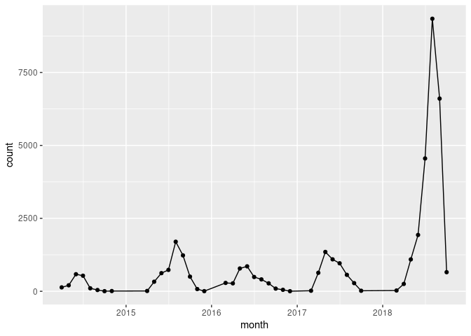

Tick Abundance
================

``` r
library(lubridate)
library(tidyverse)
```

``` r
# neonstore::neon_download("DP1.10093.001")
tck <- neonstore::neon_read("tck_taxonomyRaw-expanded")
```

    ## Rows: 3,643
    ## Columns: 32
    ## Delimiter: ","
    ## chr  [25]: uid, namedLocation, plotID, sampleID, sampleCode, subsampleID, scientificName, ...
    ## dbl  [ 1]: individualCount
    ## lgl  [ 4]: subtribe, tribe, subgenus, infraspecificEpithet
    ## dttm [ 2]: collectDate, identifiedDate
    ## 
    ## Use `spec()` to retrieve the guessed column specification
    ## Pass a specification to the `col_types` argument to quiet this message

``` r
sites <- neonstore:::neon_sites() 
```

``` r
tck_ts <- tck %>% 
  mutate(siteID = gsub("(\\w+{4})_\\d{3}", "\\1", plotID)) %>%  # NEON forgot this field this time...
  select(collectDate, siteID, scientificName, individualCount) %>%
  mutate(month = format(collectDate, "%Y-%m")) %>% 
  mutate(month = as.Date(paste(month, "01", sep="-"))) %>%
  group_by(scientificName, month, siteID) %>%
  summarize(count = sum(individualCount, na.rm = TRUE)) %>%
  ungroup()
```

## Counts

First let’s take a quick look at the raw counts data. This is less
meaningful than abundance, since we would need to account for detection
probability, and effort is not entirely constant over time or
necessarily equal across sites. Details of the estimation of beetle
density will need to take into account the specifics of the pitfall
sampling design. For now, let’s consider only the raw counts, which are
much simpler to work with and free from assumptions required to estimate
abundance:

To start, here is cumulative counts across all species: shows an
increase which is no doubt connected to increased sampling effort as
sites come online, along with an obvious seasonal pattern…

``` r
totals <- tck_ts %>% 
  group_by(month) %>%
  summarize(count = sum(count, na.rm = TRUE)) %>%
  ungroup()

totals %>% ggplot(aes(month, count)) + geom_line() + geom_point()
```

<!-- -->

2018 doesn’t have a huge spike in number of site-months being reported
though…

``` r
tck_ts %>% count(month, sort = TRUE)
```

    ## # A tibble: 43 x 2
    ##    month          n
    ##    <date>     <int>
    ##  1 2017-07-01    54
    ##  2 2017-06-01    46
    ##  3 2017-08-01    46
    ##  4 2018-06-01    43
    ##  5 2018-07-01    42
    ##  6 2016-08-01    40
    ##  7 2018-05-01    40
    ##  8 2018-08-01    40
    ##  9 2017-05-01    37
    ## 10 2016-06-01    35
    ## # … with 33 more rows
