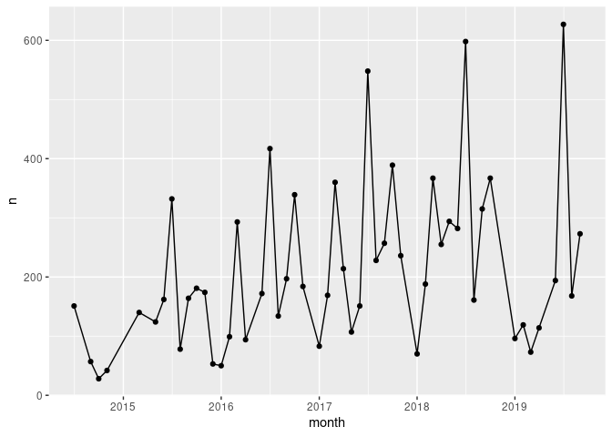
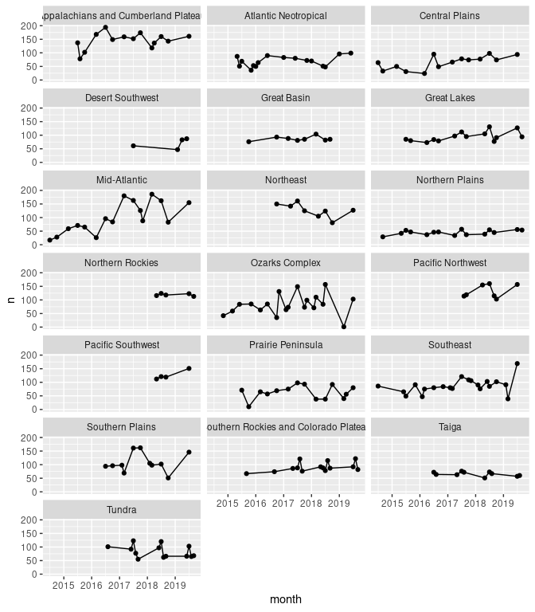

MacroInvert Community Metrics
================

``` r
library(tidyverse)
library(neonstore)
library(lubridate)
```

``` r
# neonstore::neon_download("DP1.20120.001")
inv <- neonstore::neon_read("inv_taxonomyRaw-expanded")
sites <- neonstore::neon_sites() %>% select(siteID = siteCode, domainCode, domainName)
```

``` r
richness <- inv %>%
  mutate(year = lubridate::year(collectDate)) %>%
  select(scientificName, year, siteID) %>% 
  distinct() %>%
  count(siteID, year)
richness
```

    ## # A tibble: 139 x 3
    ##    siteID  year     n
    ##    <chr>  <dbl> <int>
    ##  1 ARIK    2014    76
    ##  2 ARIK    2015    66
    ##  3 ARIK    2016   126
    ##  4 ARIK    2017   146
    ##  5 ARIK    2018   142
    ##  6 ARIK    2019    94
    ##  7 BARC    2014    47
    ##  8 BARC    2015    82
    ##  9 BARC    2016   101
    ## 10 BARC    2017    96
    ## # … with 129 more rows

# richness, monthly

``` r
inv %>%
  mutate(month = format(collectDate, "%Y-%m")) %>% 
  mutate(month = as.Date(paste(month, "01", sep="-"))) %>%
  select(scientificName, month) %>% 
  distinct() %>%
  count(month) %>% 
  ggplot(aes(month, n)) + geom_line() + geom_point()
```

<!-- -->

``` r
inv %>%
  mutate(month = format(collectDate, "%Y-%m")) %>% 
  mutate(month = as.Date(paste(month, "01", sep="-"))) %>%
  left_join(sites) %>%
  select(scientificName, month, domainName) %>% 
  distinct() %>%
  count(month, domainName) %>% 
  ggplot(aes(month, n)) + geom_line() + geom_point() + facet_wrap(~domainName, ncol = 3)
```

    ## Joining, by = "siteID"

<!-- -->

## Let’s forecast richness at each site in the following year\!

``` r
forecast <- richness %>% group_by(siteID) %>% summarize(forecast = mean(n), sd = sd(n))
```

    ## `summarise()` ungrouping output (override with `.groups` argument)

``` r
readr::write_csv(forecast, "macroinvert_richness.csv")
```
