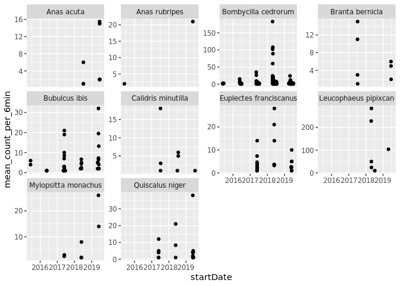
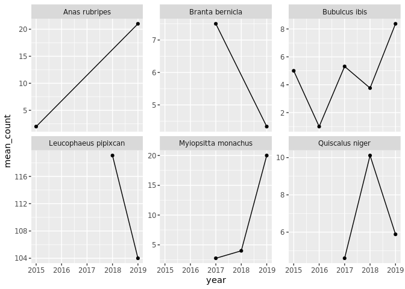
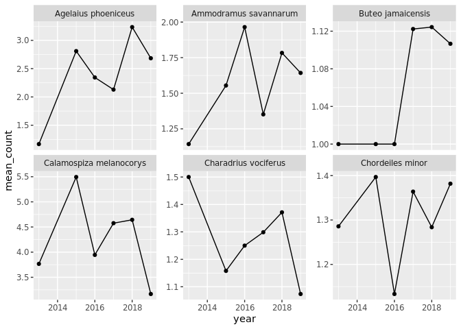

Explore
================

``` r
library(lubridate)
```

    ## 
    ## Attaching package: 'lubridate'

    ## The following object is masked from 'package:base':
    ## 
    ##     date

``` r
library(tidyverse)
```

    ## ── Attaching packages ──────────────────────────────────────────────────────────────────────────── tidyverse 1.3.0 ──

    ## ✓ ggplot2 3.3.0.9000     ✓ purrr   0.3.3     
    ## ✓ tibble  2.1.3          ✓ dplyr   0.8.4     
    ## ✓ tidyr   1.0.2          ✓ stringr 1.4.0     
    ## ✓ readr   1.3.1          ✓ forcats 0.4.0

    ## ── Conflicts ─────────────────────────────────────────────────────────────────────────────── tidyverse_conflicts() ──
    ## x lubridate::as.difftime() masks base::as.difftime()
    ## x lubridate::date()        masks base::date()
    ## x dplyr::filter()          masks stats::filter()
    ## x lubridate::intersect()   masks base::intersect()
    ## x dplyr::lag()             masks stats::lag()
    ## x lubridate::setdiff()     masks base::setdiff()
    ## x lubridate::union()       masks base::union()

``` r
bird <- readRDS("cache/bird.rds")
brd_df <- bird$brd_countdata
```

``` r
  ## sum bird (clusters) counted at each of the six minutes of the sampling event 
  ##(i.e. regardless of observerDistance and detectionMethod, or pointCountMinute)
brd_event <- brd_df %>% 
  filter(taxonRank == "species") %>%
  group_by(scientificName, pointID, siteID, plotID, eventID, startDate) %>% 
  summarize(counts_per_6min = sum(clusterSize)) %>% ungroup() 
  
## A sighting event is a 6min interval
## an eventID is plotID+pointID+startDate
## A plotID includes the siteID
```

``` r
## We can have many different points in the same plot
#brd_event %>% count(scientificName, siteID, plotID, startDate, sort=T)

## So we should average across those.
brd_plot <- brd_event %>%  
  group_by(scientificName, siteID, plotID, startDate) %>% 
  summarise(mean_count_per_6min = mean(counts_per_6min, na.rm = FALSE))

## Or at larger spatial aggregation: all plots in the site
brd_site <- brd_event %>%  
  group_by(scientificName, siteID, startDate) %>% 
  summarise(mean_count_per_6min = mean(counts_per_6min, na.rm = FALSE))

## Or across all of space: 
brd_total  <- brd_event %>%  
  group_by(scientificName, startDate) %>% 
  summarise(mean_count_per_6min = mean(counts_per_6min, na.rm = FALSE))
```

Most sampling takes place in a condensed season of several sampling
days/weeks for just a few months of the year. We thus should probably
think of these as year
averages.

``` r
brd_event %>% mutate(year = year(startDate), month = month(startDate)) %>% count(siteID, plotID, scientificName, year, month, sort = TRUE) 
```

    ## # A tibble: 38,152 x 6
    ##    siteID plotID   scientificName             year month     n
    ##    <chr>  <chr>    <chr>                     <dbl> <dbl> <int>
    ##  1 TEAK   TEAK_031 Passerella iliaca          2019     6    18
    ##  2 TEAK   TEAK_031 Poecile gambeli            2019     6    18
    ##  3 TEAK   TEAK_031 Sitta canadensis           2019     6    18
    ##  4 HEAL   HEAL_006 Passerculus sandwichensis  2019     7    14
    ##  5 HEAL   HEAL_006 Spizelloides arborea       2019     7    14
    ##  6 TEAK   TEAK_031 Contopus cooperi           2019     6    14
    ##  7 TEAK   TEAK_031 Empidonax oberholseri      2019     6    14
    ##  8 TEAK   TEAK_031 Regulus satrapa            2019     6    14
    ##  9 TEAK   TEAK_031 Setophaga coronata         2019     6    12
    ## 10 HEAL   HEAL_006 Acanthis flammea           2019     7    10
    ## # … with 38,142 more rows

``` r
common_sp <- brd_total %>%
  group_by(scientificName) %>% 
  summarise(sightings = mean(mean_count_per_6min, na.rm = FALSE)) %>% 
  arrange(desc(sightings)) 

brd_total %>% 
  inner_join(common_sp%>% head(10)) %>% 
  ggplot(aes(startDate, mean_count_per_6min)) +
  geom_point() +
  facet_wrap(~scientificName, scales="free_y")
```

    ## Joining, by = "scientificName"

<!-- -->

``` r
brd_annual_site <- brd_site %>% mutate(year = year(startDate)) %>% ungroup() %>% 
  group_by(scientificName, year) %>% summarise(mean_count = mean(mean_count_per_6min, na.rm = FALSE)) 


brd_annual_totals <- 
brd_total %>% mutate(year = year(startDate)) %>% ungroup() %>% 
  group_by(scientificName, year) %>% summarise(mean_count = mean(mean_count_per_6min, na.rm = FALSE)) 
```

Some species have crazy high counts per 6 min, perhaps not believable:

``` r
brd_annual_totals %>% inner_join(head(common_sp,6)) %>% 
    ggplot(aes(year, mean_count)) + geom_point() + geom_line() + facet_wrap(~scientificName, scales="free_y")
```

    ## Joining, by = "scientificName"

<!-- -->

Focus on timeseries:

``` r
most_data <- brd_annual_totals %>%
    inner_join(common_sp) %>% count(scientificName, sort = TRUE) %>% head(6) %>% select(scientificName)
```

    ## Joining, by = "scientificName"

``` r
brd_annual_totals %>% inner_join(most_data) %>% 
    ggplot(aes(year, mean_count)) + geom_point() + geom_line() + facet_wrap(~scientificName, scales="free_y")
```

    ## Joining, by = "scientificName"

<!-- -->
